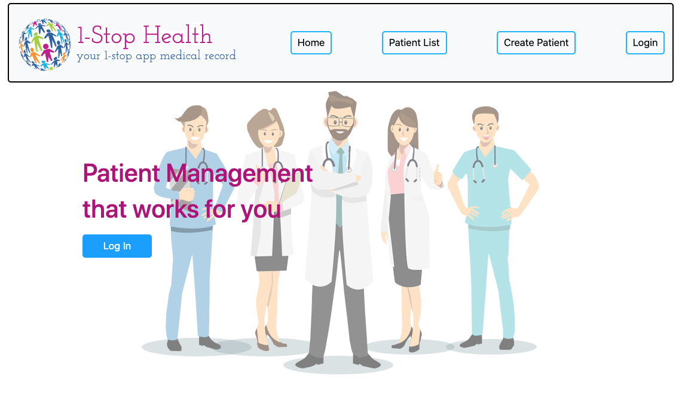
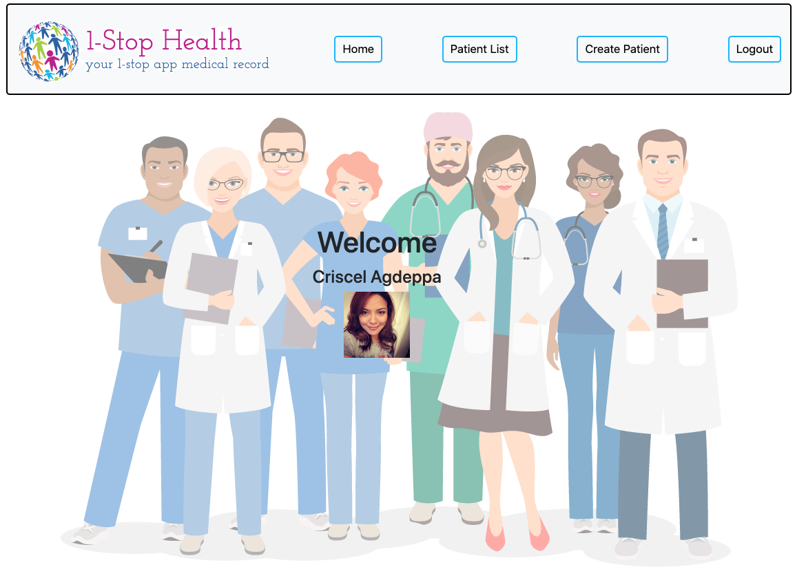
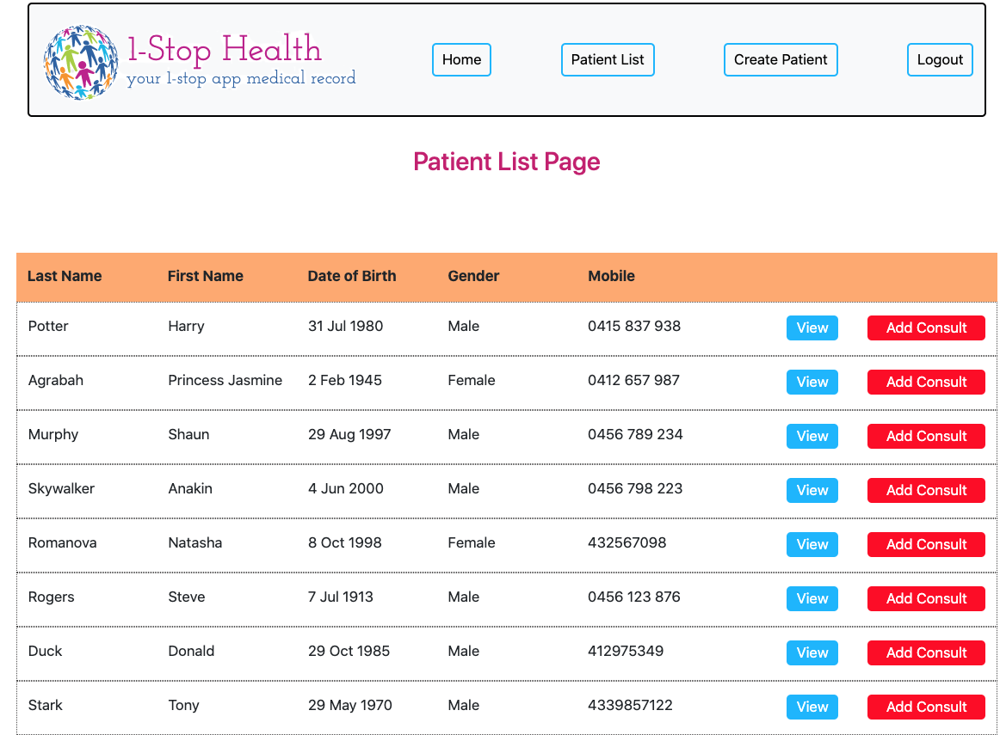
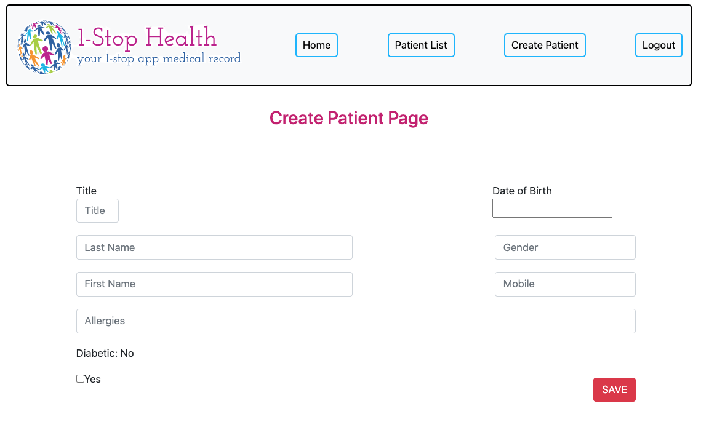

# 1-Stop Health
1-Stop health is an application that enables the health providers to access their patient details anywhere and anytime.
It is an application that store patients details without login in to a hospital or clinic local server.

# User Story
As a Health Practitioner, I would like to be able to ADD, EDIT, VIEW and DELETE a patient.

## Links
[Wire frame]('https://docs.google.com/document/d/1Jtv5fttuLUVusGA7PwHdmj6fba4O6m8FJx8scL2B9Ws/edit')  
[Heroku]('https://aqueous-taiga-75999.herokuapp.com/')  
[Presentation]('https://docs.google.com/presentation/d/1ztkmS0mmIsYuE6z2B1w218zkVI_J-NCunB53pF1-UY0/edit#slide=id.g7b21df1263_0_152')  

## Dependencies

 ### Frontend                                 
 Auth0  
 Axios  
 React  
 React-Bootstrap  
 React-Datepicker  
 React-Dom  

### Backend
Cors  
Dotenv  
Express  
Express-openid-connect  
Mongoose  
Node-stream  

## Usage
  
 
 
 
 

## Demo
[Video Demo](https://youtu.be/RpA9Hh9P-Ig) 

 ## Credits
 [Auth0](https://auth0.com/blog/complete-guide-to-react-user-authentication/)  
 [Auth0 OpenId](https://github.com/auth0/express-openid-connect)  
 React-Datepicker  
 Sass  
 React-Bootstrap  
 Axios  
 Express  
 [Mongoose](https://mongoosejs.com/)  
 Cors  
